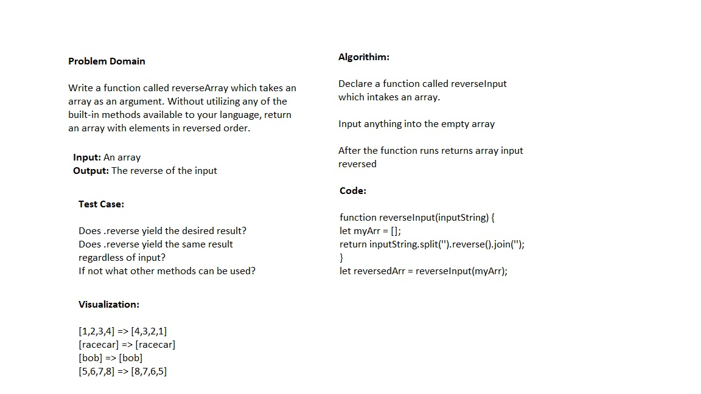

# Reverse an Array

Write a function called reverseArray which takes an array as an argument. Without utilizing any of the built-in methods available to your language, return an array with elements in reversed order.

## Whiteboard Process

## Approach & Efficiency
 What approach did you take? Discuss Why. What is the Big O space/time for this approach?

I am not familiar with this question's meaning as Big O is a new concept to me, and I will need to educate myself about it in the future.