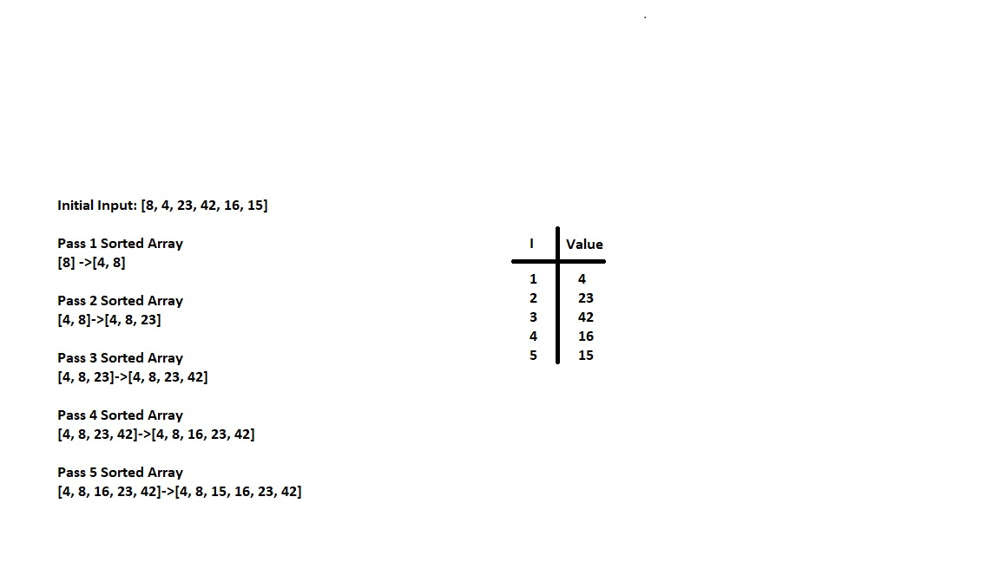

# Blog Notes: Insertion Sort

Insertion Sort is a function that takes an array and returns that array sorted in ascending order. Below is the pseudocode for the insertion sort:

## Pseudocode
Insert(int[] sorted, int value) 
  initialize i to 0 
  WHILE value > sorted[i] 
    set i to i + 1 
  WHILE i < sorted.length 
    set temp to sorted[i] 
    set sorted[i] to value 
    set value to temp 
    set i to i + 1 
  append value to sorted 

InsertionSort(int[] input) 
  LET sorted = New Empty Array 
  sorted[0] = input[0] 
  FOR i from 1 up to input.length 
    Insert(sorted, input[i]) 
  return sorted 

## Trace
Sample Array [8,4,23,42,16,15]

## Pass 1

In the first pass the inital array is passed into the insertion sort function. It then declares a new sort array and sets the index 0 of the inital array equal to the index 0 of the sorted array. It then begins the loop which calls the insert function. This first pass of this loop passes the sorted array and index 1 of the inital array because the loop starts with i=1. The insert function then sorts the numbers into the correct order and returns the sorted array.

## Pass 2

The second pass has i equal to 2 because of the incrementation of the for loop. This means when the insert function is called the sorted array and the value of index 2 of the inital array is passed. The insert function then sorts the numbers into the correct order and returns the sorted array.

## Pass 3

The third pass has i equal to 3 because of the incrementation of the for loop. This means when the insert function is called the sorted array and the value of index 3 of the inital array is passed. The insert function then sorts the numbers into the correct order and returns the sorted array.

## Pass 4

The fourth pass has i equal to 4 because of the incrementation of the for loop. This means when the insert function is called the sorted array and the value of index 4 of the inital array is passed. The insert function then sorts the numbers into the correct order and returns the sorted array.

## Pass 5

The fifth pass has i equal to 5 because of the incrementation of the for loop. This means when the insert function is called the sorted array and the value of index 5 of the inital array is passed. The insert function then sorts the numbers into the correct order and returns the sorted array.

## Efficiency
Time: O(n)
Space: O(n)

## Visual

